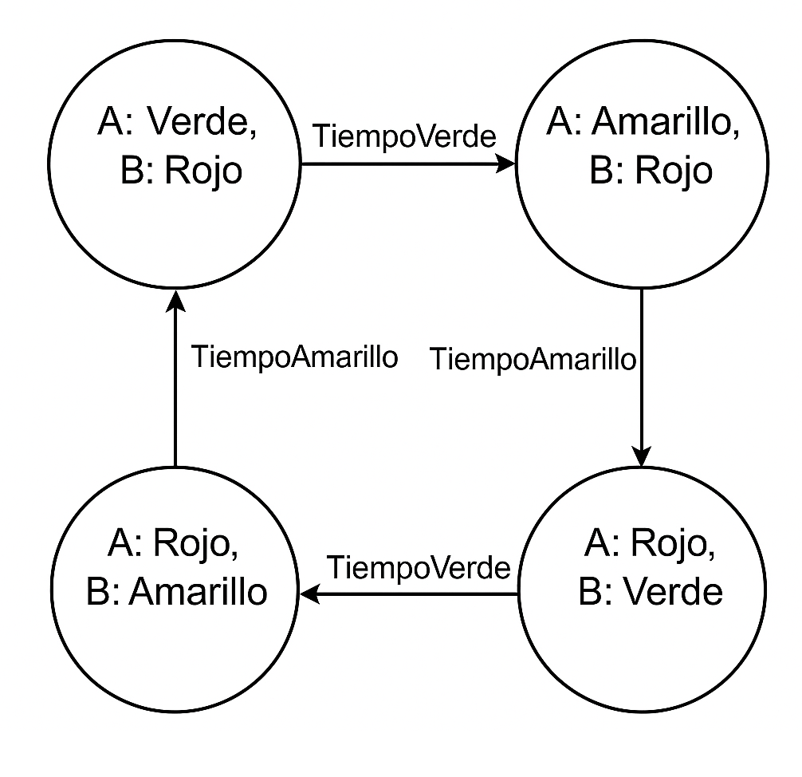

# Parte B: FSM de Semáforos en Intersección

## Descripción
En esta parte se diseña e implementa una Máquina de Estados Finitos (FSM) para simular el comportamiento de dos semáforos perpendiculares (A y B), garantizando que nunca estén en verde al mismo tiempo y respetando los tiempos estándar de cada fase.

## Hardware y Pines

- **Semáforo A:**
  - Rojo: `CONTROLLINO_D0`
  - Amarillo: `CONTROLLINO_D1`
  - Verde: `CONTROLLINO_D2`

- **Semáforo B:**
  - Rojo: `CONTROLLINO_D6`
  - Amarillo: `CONTROLLINO_D7`
  - Verde: `CONTROLLINO_D8`

## Estructuras de Datos

```cpp
// Estados de la FSM
typedef enum {
  ESTADO_A_VERDE,
  ESTADO_A_AMARILLO,
  ESTADO_B_VERDE,
  ESTADO_B_AMARILLO
} EstadoSemaforo_t;

// Representación de un semáforo
typedef struct {
  uint8_t pinRojo;
  uint8_t pinAmarillo;
  uint8_t pinVerde;
} Semaforo_t;

const Semaforo_t semA = {CONTROLLINO_D0, CONTROLLINO_D1, CONTROLLINO_D2};
const Semaforo_t semB = {CONTROLLINO_D6, CONTROLLINO_D7, CONTROLLINO_D8};
```

## Temporización

```cpp
const unsigned long TIEMPO_VERDE    = 5000;  // 5 segundos
const unsigned long TIEMPO_AMARILLO = 1000;  // 1 segundo
unsigned long tiempoAnterior = 0;
EstadoSemaforo_t estadoActual = ESTADO_A_VERDE;
```

## Lógica de la FSM

1. **ESTADO_A_VERDE:**
   - Activa verde A, rojo B.
   - Al cumplirse `TIEMPO_VERDE`, pasa a `ESTADO_A_AMARILLO`.

2. **ESTADO_A_AMARILLO:**
   - Activa amarillo A, rojo B.
   - Al cumplirse `TIEMPO_AMARILLO`, pasa a `ESTADO_B_VERDE`.

3. **ESTADO_B_VERDE:**
   - Activa verde B, rojo A.
   - Al cumplirse `TIEMPO_VERDE`, pasa a `ESTADO_B_AMARILLO`.

4. **ESTADO_B_AMARILLO:**
   - Activa amarillo B, rojo A.
   - Al cumplirse `TIEMPO_AMARILLO`, pasa a `ESTADO_A_VERDE`.

En cada iteración del `loop()`, se lee `millis()`, se ejecuta la lógica del estado actual y se controla la transición según el tiempo transcurrido.

## Uso

1. Abre `ParteB/Practica2_ParteB.ino` en Arduino IDE.
2. Configura la placa **Controllino Mega** y el puerto COM.
3. Conecta los LEDs al Controllino según los pines definidos.
4. Carga el sketch y observa el ciclo de los semáforos.


<div align="center">
  
</div>
